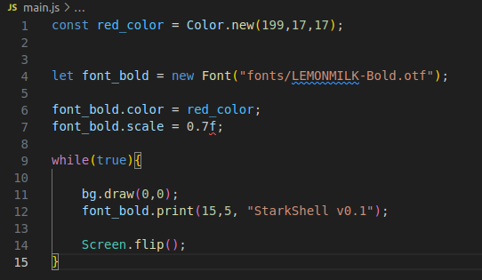
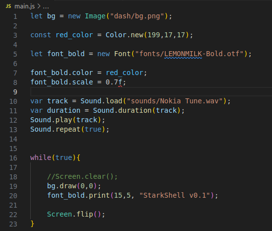

<h1 align=center>Tutorial AthenaEnv</h1>

  
Índice

  <ol>
    <li>
      <a href="#about_ae">Sobre AthenaEnv</a>
    </li>
    <li>
      <a href="#how_to_use">Como utilizar o AthenaEnv</a>
    </li>
    <li><a href="#prerequisites">Pré-requisitos</a></li>
    <li><a href="#demo">Demonstração</a></li>
    <ul>
        <li><a href="#print_text">Exibindo texto</a></li>
        <li><a href="#draw_img">Exibindo imagem</a></li>
        <li><a href="#play_audio">Reproduzindo audio</a></li>
    </ul>
  </ol>

<h2 id="about_ae" align=center>O que é o AthenaEnv?</h2>

AthenaEnv é um projeto que busca facilitar e ao mesmo tempo trazer um kit completo para os usuários criarem um software homebrew para PlayStation 2 utilizando a linguagem JavaScript. Possui dezenas de funções integradas, tanto para criar jogos quanto para aplicativos. A principal vantagem em usar o projeto AthenaEnv ao invés do PS2SDK puro é acima de tudo a praticidade, você vai usar uma das linguagens mais simples possíveis para criar o que tem em mente, além de não precisar compilar, apenas script e testar, rápido e simples.

<i>Texto acima foi retirado da documentação oficial</i>

<h2 id="how_to_use" align=center>Como utilizar o AthenaEnv.</h2>

Essa documentação foi criada com base na documentação oficial do <b>AthenaEnv</b>, que você encontra <a href="https://github.com/DanielSant0s/AthenaEnv">aqui</a>,projeto esse criado pelo <a href="https://github.com/DanielSant0s">DanielSan0s</a>, tendo em vista que assistindo ao video de demonstração nos comentários tinha alguns usuários querendo que fosse explicado de forma mais prática ou um passo-a-passo. 
Como é dito na documentação oficial, é desejável um prévio conhecimento em JavaScript.

<h3 id="prerequisites">Pré-requisitos</h3>

É necessário criar/editar arquivos em .js, então opte por utilizar uma IDE, exemplo : <b>Visual Studio Code(Com extensão para JavaScript)</b> e o PCSX2(1.7.0 acima,ativando o Host Filesystem).

Para ativar o Host Filesystem, vá em <b>System/Game Settings/Enable Host Filesystem</b>

<b>Obs.: Não consegui realizar os testes no Linux Ubuntu 22.04, pode ser algo especifico do meu ambiente!Mas testado no Windows.</b>

No VSCode, procure pela pasta do AthenaEnv que você baixou, dentro dela terá os paths :
<ul>
<li>amp</li>
<li>cursor</li>
<li>dash</li>
<li>fonts</li>
<li>pads</li>
<li>pong</li>
<li>render</li>
<li>sounds</li>
<li>store</li>
<li>usr</li>
</ul>

Esses paths são referente aos *.js , se você abrir cada arquivo .js você verá que em seu código vai ter um apontamento para o path especifico, caso queria fazer sua aplicação do zero, basta ter os .elf do AthenaEnv e o seu main.js, daqui para frente é nele que vamos trabalhar.

<h3 id="demo">Demonstração</h3>

Segue abaixo, alguns exemplos bem básicos

<li id="print_text">Exibindo texto na tela</li>

Para exibir apenas um texto na tela, segue um exemplo :

//defina uma constante informando a cor do texto, no 
//exemplo temos a cor vermelho 
    
    const red_color = Color.new(199,17,17);

//para importar uma fonte, é necessário informar o path /fonte
//criando a variável para isso 

    let font_bold = new Font("fonts/LEMONMILK-Bold.otf");

//agora para definir a propriedade da cor na font, basta informar
//a variavel.color = variável_da_cor; 
    
    font_bold.color = red_color;

//também é possível definir o tamanho da fonte 
    
    font_bold.scale = 0.7f;

//a partir daqui, dentro desse ciclo, será gerado a imagem na tela 

    while(true){

//informe a variável que quer exibir seguido de .print(x,y,"texto"); 

    font_bold.print(15,5, "StarkShell v0.1");

    Screen.flip();
    }
 
Seu código deve estar parecido com isso :

 salve o arquivo, e teste o athena.elf no emulador, se tudo estiver correto,será exibido na tela o texto "StarkShell v0.1" no caso do nosso exemplo

<li id="draw_img">Exibir imagem .png na tela, segue o exemplo</li>

Crie a variável 
//passando new Image("path/imagem.png"); 
        
    let bg = new Image("dash/bg.png");

e passe essa variável dentro do while como

    bg.draw(0,0); //sendo 0,0 referente a x e y 

<li id="play_audio">Adicionando som de fundo</li>   
    //pode ser passado for do while
    
    var track = Sound.load("sounds/seu_audio.wav");
    var duration = Sound.duration(track);
    Sound.play(track);
//caso queria que a musica fique em loop 
    
    Sound.repeat(true); 
 
Com imagem e som adicionados ao código, teremos algo assim :
